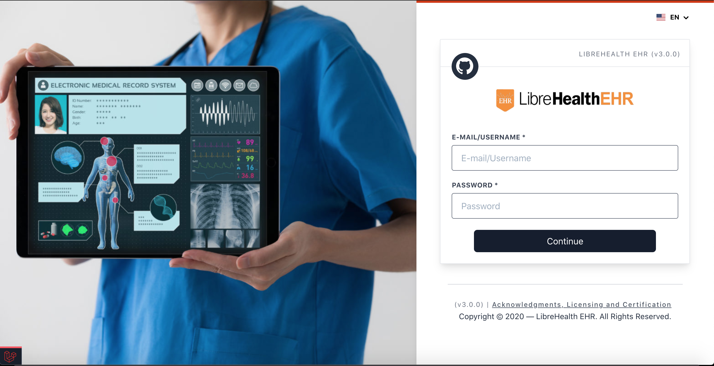

<p align="center">
  <a href="#" target="_blank">
    
  </a>
  <h1 align="center">LibreHealth EHR</h1>
  <br />
</p>

[](https://github.com/LibreHealthIO/lh-ehr-laravel/actions/workflows/run-tests.yml)

LibreHealth EHR is a free and open-source electronic health records and medical practice management application.

The mission of LibreHealth is to help provide high quality medical care to all people, regardless of race, socioeconomic status, or geographic location, by providing medical practices and clinics across the globe access to free of charge medical software. That same software is designed to save clinics both time and money, which gives practitioners more time to spend with individual patients, thereby supplying patients with higher quality care.

We are current and former contributors to OpenEMR and thank that community for years of hard work. We intend to honor that legacy by allowing this new community to leverage the good things in OpenEMR, share what we create and not be afraid to break backward compatibility in the name of forward progress and modern development models.

We are collaborating closely with the [LibreHealth Project](http://librehealth.io), an umbrella organization for health IT projects with similar goals.

  <p align="center">
    
  </p>

## Table of Contents

1. [Requirements](#requirements)
2. [Installation](#installation)
3. [Usage](#usage)
4. [Documentation](#documentation)
5. [Change log](#change-log)
6. [Testing](#testing)
7. [Contributing](#contributing)
8. [Security](#security)
9. [Credits](#credits)
10. [License](#license)

## Requirements

Make sure your server meets the following requirements.

-   Apache 2.2+ or nginx
-   MySQL Server 5.7.8+ , Mariadb 10.3.2+ or PostgreSQL
-   Composer installed 2.0+
-   PHP Version 8.0.x+

### PHP extensions

Make sure you have the following php extensions enabled

```
bz2, curl, date, dom, exif, gd, gettext, grpc,
imagick, intl, json, libxml, mbstring, mysqli, mysqlnd, openssl, PDO,
pdo_mysql, posix, protobuf, soap, sqlite3, xml, xmlreader, xmlwriter
xsl, zip, zlib
```

## Installation

Install composer with the help of the instructions given [here](https://getcomposer.org/doc/00-intro.md#installation-linux-unix-macos)

```bash
$ wget https://getcomposer.org/composer.phar
$ chmod +x composer.phar
$ mv composer.phar /usr/local/bin/composer
```

Install Node.js/NPM with the help of the instructions given [here](https://nodejs.org/en/download/package-manager/)

Linux/Unix `yum install npm` OR using MacOs `brew install node`

Fork and/or clone this project by running the following command

```bash
$ git clone https://github.com/LibreHealthIO/lh-ehr-laravel.git
```

Navigate into the project's directory

```bash
$ cd lh-ehr-laravel
```

Copy .env.example for .env and modify according to your credentials

```bash
cp .env.example .env
```

Run this command to install dependencies

```bash
composer install --prefer-dist
```

This command will install all dependencies needed by the Akivas platform to run successfully!

Generate application key

```bash
php artisan key:generate
```

Install npm/yarn dependencies (Preference is using **Yarn**)

```bash
npm install or yarn install
```

This command will help migrate the database and populate the database!

```bash
php artisan migrate --seed
```

Or if for any reason, you wish to reset the database later, you can run

```bash
php artisan migrate:fresh --seed
```

## Usage

Run yarn/npm in dev mode
`npm run dev` OR `yarn run dev`

For live building of components while developing, you can run

`npm run watch` OR `npm run watch-poll`

Run the default laravel server

```bash
php artisan serve
```

To view LibreaHealth's EHR Platform, go to:

```php
http://localhost:8000/
```

If you want to serve to another port for example (3000), Run the following

```bash
php artisan serve --host=<your_ip_address> --port=3000
```

Then view it on the browser by typing `http://<your_ip_address>:3000`

#### Login Credentials

By default, two(02) accounts are created with default roles - **super_admin** and **admin** which are all active.

-   Super Admin Account:

    -   _Username_: `s_admin`
    -   _Email_: `s_admin@librehealthehr.com`
    -   _Password_: `s_admin123`

-   Admin Account **(recommended)**:
    -   _Username_: `admin`
    -   _Email_: `admin@librehealthehr.com`
    -   _Password_: `admin123`

## Change log

Please see the [changelog](changelog.md) for more information on what has changed recently.

## Testing

Testing is very essential as this helps us to avoid bad practices and breaking code.
To test the application, ensure to have the test env variables in the `.env.testing` file, if not create one using the
`cp .env.example .env.testing`

```
TEST_DB_HOST=127.0.0.1
TEST_DB_DATABASE=lh_ehr_testing
TEST_DB_USERNAME=root
TEST_DB_PASSWORD=
```

Create a database for testing. Here, we will be using mysql for our db test since it supports column dropping etc,
You can use **pgsql**, if you like by changing the default connection `lh_ehr_testing` driver pgsql in the `config/database.php`.

By default, the test connection is added to the `phpunit.xml` file. Feel free to edit this if needed to suit your custom
database connection by changing the `<env name="DB_CONNECTION" value="lh_ehr_testing"/>` to
`<env name="DB_CONNECTION" value="custom_connection"/>`

Create the test database **(lh_ehr_test)** and re-migrate your data and seed using the following command
`php artisan migrate --database=lh_ehr_testing `
`php artisan db:seed --database=lh_ehr_testing `

Or fresh install `php artisan migrate:fresh --database=lh_ehr_testing --seed`

Run the tests using:

```bash
$ composer test
```

## Documentation

Official documentation is available [Here](https://docs.librehealth.io/projects/ehr/index.html).

## Code Quality/Tools

We use [Php CodeSniffer](https://github.com/squizlabs/PHP_CodeSniffer) to ensure
code quality and we all are using the same standards. This is enabled by default for this
project and incorporated in the hooks when committing `.git/hooks`.

It is however advised to install this globally so as to manage a variety of projects

`composer require global squizlabs/php_codesniffer`

**NB:**

-   When you have modified or made changes to a file, ensure to run `./vendor/bin/phpcs` to ensure all files are valid or
    fix them using `./vendor/bin/phpcbf`.

Also you can use pre-commit hooks to point the git hooks to the `.githooks` by running `git config core.hooksPath .githooks`
for validating upon committing.

## Troubleshooting

Before opening an issue, please refer to the [troubleshoot guide](troubleshooting.md)

## Contributing

Please see [contributing.md](contributing.md) for details and a todolist.

## Security

If you discover any security related issues, please email infrastructure@libreahealth.io
instead of using the issue tracker.

## Credits

-   [Mua Rachmann](https://github.com/muarachmann)

## License

LibreHealth EHR is primarily licensed under Mozilla Public License Version 2.
The code inherited from OpenEMR is licensed under GPL 2 or higher. This project is a part of the
[Software Freedom Conservancy](http://sfconservancy.org/) family.

Thank you for your support!
